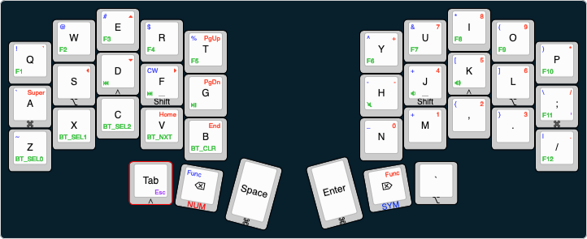

# Layout
I started with an initial layout from the following Repo:

https://github.com/jporter-dev/zmk-config/tree/caa003af2909f47dbd53cbb89e51d7bd0c010513?tab=readme-ov-file



# German Umlaute
Um Umlaute zu schreiben, habe ich die folgende Bibliothek verwendetz: https://github.com/urob/zmk-helpers 

Damit diese funktioniert musste ich auf mac os folgendes einstellen:

1. **In macOS die „Unicode Hex Input“-Eingabequelle aktivieren**
2. **`HOST_OS` für macOS richtig setzt**
3. **Die passenden Unicode-Helper in deiner ZMK-Config einbindest**

---

## 1. Unicode-Eingabe unter macOS aktivieren
- Öffne die **Systemeinstellungen** (bzw. „System Settings“ auf englischen Systemen).
- Navigiere zu **Tastatur** -> **Eingabequellen**.
- Klicke auf das **Plus-Symbol** \(+\).
- Scrolle runter bis zu **Weitere** / **Others** und wähle dort „**Unicode Hex Input**“.
- Füge diese Eingabequelle hinzu.
- Achte darauf, dass du in der macOS-Menüleiste (Input Source-Auswahl) nun zwischen deinem normalen Layout und „Unicode Hex Input“ wechseln kannst.

> **Tipp**: Evtl. möchtest du einen Shortcut in macOS anlegen, um schnell zwischen deinen Eingabequellen zu wechseln.

---

## 2. `HOST_OS` in ZMK auf `2` setzen
In deiner Keymap-Datei muss stehen:

```c
#define HOST_OS 2
```

Dies signalisiert den ZMK-Helpern, dass du **macOS** verwendest und entsprechend die Eingabelogik anpasst.

---

## 3. Die passenden Unicode-Helper einbinden
Anschließend bindest du den Helper und die benötigte Sprachdatei ein, z.B. „german.dtsi“.  
Das Ganze sieht zum Beispiel so aus (ganz oben in der `.keymap`-Datei oder wo du deine Includes hast):

```c
#include "zmk-helpers/helper.h"
#include "zmk-helpers/unicode-chars/german.dtsi"
```

Damit bekommst du Zugriff auf die vordefinierten Keycodes, die „german.dtsi“ mitbringt (etwa `de_ae` für „ä“, `de_oe` für „ö“ usw.).

---

## Umlaute in deinem Keymap-Layout definieren
Jetzt brauchst du in deinem Keymap-Layout selbst nur noch den jeweiligen Unicode-Keycode auf einen Tastendruck zu legen. In meinem Fall habe Ich die Umlaute mit einem doppelten tastendruck auf diejeweils passenden Buchstaben gelegt. Also ä auf a + a, ü auf u + u usw.

```dts
    td_uml_a: td_umlaut_a {
      compatible = "zmk,behavior-tap-dance";
      label = "TAP_DANCE_UMLAUT_A";
      #binding-cells = <0>;
      tapping-term-ms = <200>;
          bindings = <&hm LGUI A>, <&kl>;
    };
```

  